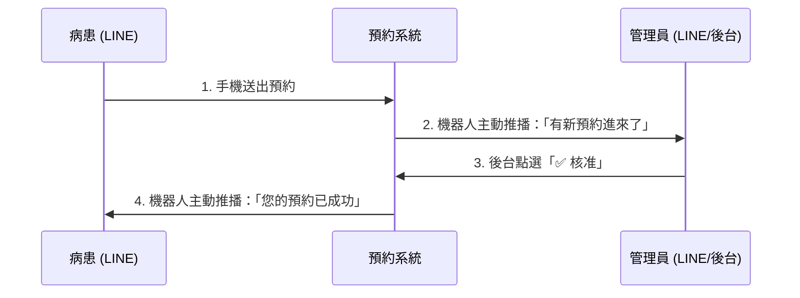

# 🏥 診所預約系統操作手冊

本手冊為您介紹「使用者（病患）」與「管理員（診所人員）」的操作流程。

---

## 👩‍🦰 第一部分：使用者操作手冊

使用者進入 LINE 官方帳號後，操作流程簡單快速。

### 1️⃣ 我要預約 (新預約)
> **操作路徑**：打開 LINE 官方帳號 ➡️ 點擊下方選單「立即預約」

1. **👆 選擇日期**：在日曆上點擊想要的日期（灰色日期代表休診或無法預約）。
2. **⏰ 選擇時段**：下方會顯示剩餘空檔（○ 可預約 / ● 額滿）。點擊需要的時間。
3. **✍️ 填寫資料**：
   * 姓名：系統會自動帶入 LINE 暱稱，可點擊修改為真實姓名。
   * 備註（選填）：可稍微說明看診原因（如：初診、定期洗牙）。
4. **✅ 確認送出**：點擊綠色【確認預約申請】按鈕，並等待診所通知。

### 2️⃣ 查看或取消預約
> **操作路徑**：打開 LINE 官方帳號 ➡️ 點擊下方選單「我的預約」

1. **👀 查看結果**：點擊上方「我的預約」標籤。您會看到：
   * 🟡 **核定中**：診所處理中。
   * 🟢 **已核定**：成功預約。
   * 🔴 **已退回** / **已取消**：預約失敗或已自行取消。
2. **❌ 自行取消**：若臨時有事，可在清單右側點擊「取消本次看診」，即可將時段讓給其他人。

---

## 👨‍💻 第二部分：管理員操作手冊

管理員可透過手機或電腦，開啟特定後台網址進行管理。

### 1️⃣ 登入系統
> **操作路徑**：進入後台網址 ➡️ 密碼登入
* 🔑 預設密碼：輸入 `0811`。
* 看到上方出現「管理員模式」代表登入成功。

### 2️⃣ 審核待處理預約 (待審核)
您會在這個分頁看到所有新進的預約申請（使用者剛送出時，該使用者的列表會顯示黃色的「待審核」）。

* **✅ 核准**：
  * 點擊【核准】按鈕。
  * 系統會將該時段保留給患者，並**自動發送 LINE 通知**告訴病患：「預約成功及時間」。
* **❌ 拒絕**：
  * 點擊【拒絕】按鈕。
  * 系統會跳出提示窗，您可以輸入退回原因（例如：「該時段醫生有手術」、「請改約下週」）。如果不輸入則使用預設格式。
  * 系統會**自動發送 LINE 通知**告訴病患。

### 3️⃣ 主動聯絡病患 (聯絡)
* 💬 在每一筆預約的右側，有一個 **【聯絡】** 按鈕。
* 若有突發狀況（如：看診進度延遲），點擊後輸入文字，系統會代表官方帳號發送該段文字給該名病患者。

### 4️⃣ 休假 & 強制營業設定 (日曆管理)
若遇到特殊情況（如補班日、國定假日），您可以自行覆蓋預設的休假規則。
> **操作路徑**：點擊「日曆管理」分頁

1. 📅 **選擇日期**：點擊年/月/日。
2. ⚙️ **選擇狀態**：
   * **強制關閉預約**：設定哪一天醫師休診，日曆會變灰。
   * **強制開放預約**：通常週日休假，若遇到週日要看診，即可用此選項。
3. 💾 點擊【保存設定】生效。下方可隨時【移除設定】恢復預設。

### 5️⃣ 現場掛號或電話預約代建 (手動新增)
若遇到阿公阿嬤打電話來掛號，管理員可代為建立。
> **操作路徑**：點擊「手動新增」分頁

1. 👤 直接輸入病患姓名。
2. 📅 點選對應的日期與時間。
3. ✅ 點擊【建立預約】。此筆紀錄會直接進入「全部預約」且無須審核。

---

### 🌟 系統自動通知機制懶人包 

